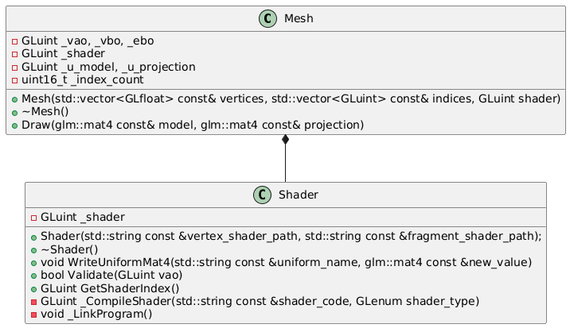

# Cool Milestones

### Spinning Pyramid 


The basics! VAOs, VBOs, IBOs, shaders, transforms, projection... Nothing crazy, but gotta start somewhere!

# Design Stuff

### First Refactor

**Goal:** Encapsulate model data and state into generic Mesh class

- Should only focus on holding a mesh object and its functionality (drawing, mainly)
    - **Rationale:** We want a generic mesh class so we can have many different objects with a common interface 
- Each mesh has its own VAO, VBO(s?), and EBO
    - Vertices and indices are supplied in constructor 
        - **Rationale:** They need be hand-defined to construct model 
- Shader should be assigned in constructor
    - **Rationale:** Decoupling shader from object may get hard to manage 
    - Since uniforms are set every draw call, we should pass them to our draw function
- Use RAII! Construction and destruction of mesh object should handle its resources automatically
- For now, each shader only has `model` and `projection` as uniforms which we pass to the model class via draw func.
    - Custom uniforms require a more advanced interface to handle all types; too much for current goal. 
- If magic numbers were kept, it would be because replacing them detriments readability
> e.g. We only want 1 VBO, VBO, EBO ever for now. Better to just leave 1 in `glGenBuffers` than to have a constant representing this count, giving the reader one more symbol to worry about. 
- Failure in construction immediately terminates program
    - Can only really happen if shader validation fails
    - Why not validate before constructor?
        - Shader validation requires VAO to be bound, which we make in constructor...
        - Must do validation inside its body!
    - We could do recovery with exceptions, but is more complicated
    - For current scope, simply logging error and exiting is best.


### Shader Object

**Goal:** To have an easily manipulable shader object that composes a mesh object 

- Uniforms will be a map, where key is uniform name and value is the index of the uniform 
- Types will be a problem! 
    - Specify type when adding uniform; include it in the value 
```cpp
// Example:
std::map<std::string, std::pair<GLuint, UniformType>> _uniforms;

shader.AddUniform("uniform_name", UniformType.MAT4);
shader.WriteUniform("uniform_name", new_value); // Knows type and handles accordingly
```
- Assume pointer type variant for all uniforms, since thats what we've been doing and seems easiest
    - *This might introduce errors!* Stay wary.
- Each shader will be bound to its mesh at initialization
> We might wanna swap shaders later; this will come later...
- As always, use RAII!

#### Revision 1:

- Simply write the uniforms with a wrapper to the uniform writer for that type; we just need to pass a name and a value



- **WARNING:** RIGHT NOW, THE COUPLING RELATIONSHIP BETWEEN SHADER AND MESH MIGHT BE A PERFORMANCE ISSUE
> e.g. Having to bind and unbind the shader every time we set a uniform might be expensive... *Investigate!*

# Learnings

- It's wise to use library-specific types with that library; they may be aliases that help that type behave the same across systems.
> `GLfloat` for GL stuff, `glm::float32` for GLM stuff, etc.

### Solving the Mouse Drift Problem 

**Issue:** Mouse movement deltas aren't cleared once mouse is lifted; this causes drift when no mouse input.

**Constraints:**
- Can't check mouse state without this callback
- Callback is made by window; look movement is handled by camera (we don't want spaghetti)

**Solution:** 
- Pass window to camera controls
- Camera consumes window deltas 
- Camera then resets window deltas to 0

**Tradeoffs:**
- Requires setting window deltas outside callback which isn't ideal
- Requires passing window to input handler functions which is ugly
> Might fix this by making camera keep its own deltas
