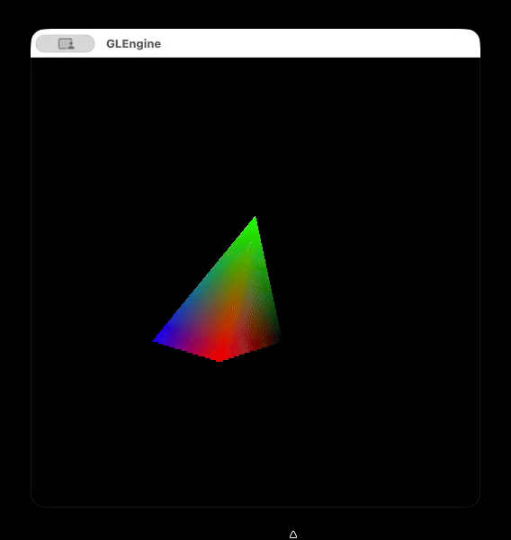
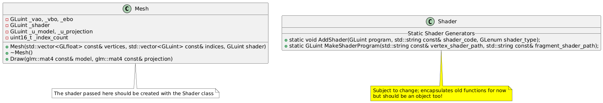

# Cool Milestones

### Spinning Pyramid 

The basics! VAOs, VBOs, IBOs, shaders, transforms, projection... Nothing crazy, but gotta start somewhere!

# Design Stuff

### First Refactor

**Goal:** Encapsulate model data and state into generic Mesh class

- Should only focus on holding a mesh object and its functionality (drawing, mainly)
    - **Rationale:** We want a generic mesh class so we can have many different objects with a common interface 
- Each mesh has its own VAO, VBO(s?), and EBO
    - Vertices and indices are supplied in constructor 
        - **Rationale:** They need be hand-defined to construct model 
- Shader should be assigned in constructor
    - **Rationale:** Decoupling shader from object may get hard to manage 
    - Since uniforms are set every draw call, we should pass them to our draw function
- Use RAII! Construction and destruction of mesh object should handle its resources automatically
- For now, each shader only has `model` and `projection` as uniforms which we pass to the model class via draw func.
    - Custom uniforms require a more advanced interface to handle all types; too much for current goal. 
- If magic numbers were kept, it would be because replacing them detriments readability
> e.g. We only want 1 VBO, VBO, EBO ever for now. Better to just leave 1 in `glGenBuffers` than to have a constant representing this count, giving the reader one more symbol to worry about. 
- Failure in construction immediately terminates program
    - Can only really happen if shader validation fails
    - Why not validate before constructor?
        - Shader validation requires VAO to be bound, which we make in constructor...
        - Must do validation inside its body!
    - We could do recovery with exceptions, but is more complicated
    - For current scope, simply logging error and exiting is best.

